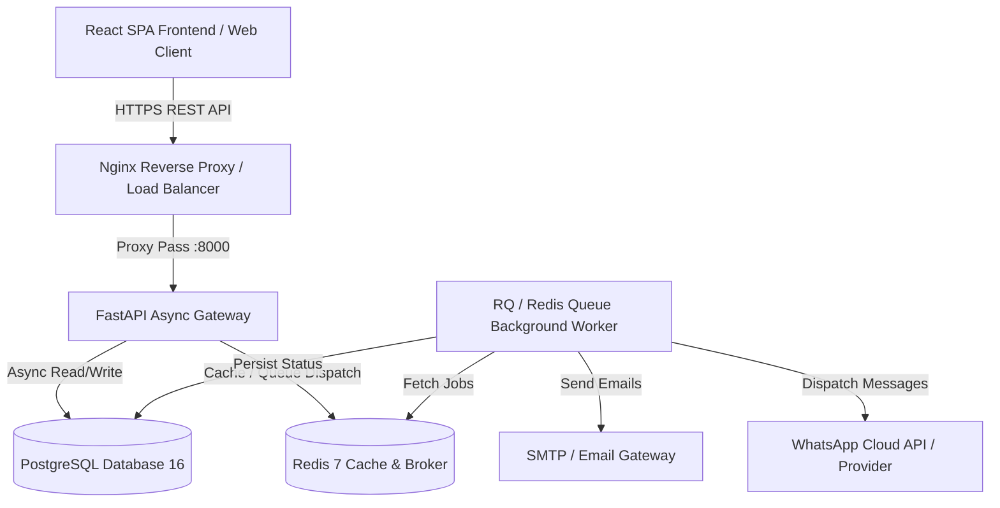
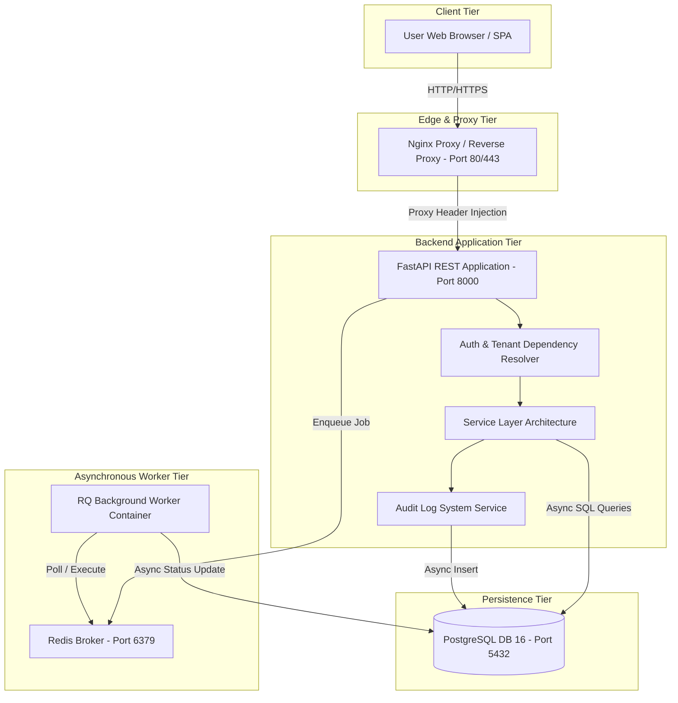
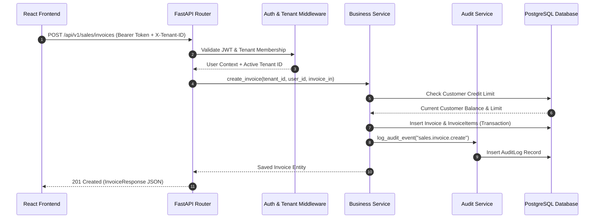

# BizSathi — Complete Technical & Functional Project Documentation

> **Document Type:** Production Launch Technical Documentation & Architecture Manual  
> **Target Audience:** CTO, Technical Lead, System Administrators, Senior Developers  
> **Project Name:** BizSathi — Multi-Tenant MSME Enterprise Resource & Business Management Platform  
> **Version:** 1.0.0 (Production Release Candidate)  
> **Date:** September 2026  
> **Document Status:** Authoritative Source of Truth  

---

## Table of Contents
1. [Project Overview](#1-project-overview)
2. [Technology Stack](#2-technology-stack)
3. [System Architecture](#3-system-architecture)
4. [Database Documentation](#4-database-documentation)
5. [API Documentation](#5-api-documentation)
6. [Feature Documentation](#6-feature-documentation)
7. [Authentication & Authorization](#7-authentication--authorization)
8. [Backend Architecture](#8-backend-architecture)
9. [Frontend Architecture](#9-frontend-architecture)
10. [Third-Party Integrations](#10-third-party-integrations)
11. [Error Handling & Validation](#11-error-handling--validation)
12. [Security](#12-security)
13. [Environment Configuration](#13-environment-configuration)
14. [Deployment & Infrastructure](#14-deployment--infrastructure)
15. [Logging & Monitoring](#15-logging--monitoring)
16. [Database Migrations & Data Management](#16-database-migrations--data-management)
17. [Testing](#17-testing)
18. [Production Readiness](#18-production-readiness)
19. [Known Issues & Technical Debt](#19-known-issues--technical-debt)
20. [Future Improvements](#20-future-improvements)
21. [Glossary](#21-glossary)
22. [Production Launch Summary](#22-production-launch-summary)

---

## 1. Project Overview

### Purpose of the Project
**BizSathi** is an all-in-one, multi-tenant Software-as-a-Service (SaaS) platform designed specifically for Micro, Small, and Medium Enterprises (MSMEs) in India and emerging markets. It bridges the gap between complex enterprise ERPs and fragmented single-purpose tools by delivering a unified, real-time operating system for business operations.

BizSathi integrates Customer Relationship Management (CRM), Sales & Invoicing, Inventory & Stock Management, Human Resource Management (HRM) & Payroll, Office Expense Management, Marketing Automation (WhatsApp & Email Campaigns), Audit Logging, and Multi-Tenant Administration into a high-performance web platform.

### Main Goals and Use Cases
* **Centralized Business Management:** Single-pane dashboard for owners and department managers to track revenue, customer debt, active sales pipelines, inventory stock levels, workforce attendance, and expense outflows.
* **Strict Multi-Tenant Isolation:** Complete logical isolation of data per organization (tenant) using row-level tenant identification (`tenant_id`), preventing cross-tenant leaks.
* **Automated Sales-to-Cash Workflow:** Seamless conversion of Leads to Customers, Quotations to Invoices, with automatic credit limit validation, payment receipt generation, and customer outstanding balance ledgers.
* **Real-Time Inventory Control & Stock Ledger:** Track products, SKU categories, unit definitions, reorder threshold alerts, physical count adjustments with variance tracking, stock valuation, bulk CSV imports, and automated stock deduction/reversal on sales invoices.
* **HRM & Payroll Compliance:** Attendance check-in/out calculation, leave request workflows with balance tracking, salary advance deductions, and automated monthly payroll runs generating downloadable HTML/PDF payslips.
* **Targeted Marketing Campaigns:** Audience segmentation by city or customer type, WhatsApp template approval workflows, and multi-channel campaign dispatch (WhatsApp/Email).
* **Enterprise Auditability:** Immutable, event-driven audit logging for all critical operations (login, data modification, stage movement, payment recording, settings changes).

### High-Level Architecture
BizSathi follows a modern **Decoupled Single-Page Application (SPA) + Asynchronous API Gateway + Background Task Queue** architecture:



### Component Interaction Summary
1. **Frontend UI (React 19 + TypeScript + Vite):** Handles user interactions, local state, responsive UI rendering, authentication guard evaluation, and API requests via Axios.
2. **Backend API Gateway (FastAPI + AsyncPG):** Validates incoming requests, authenticates JWT tokens, enforces RBAC permissions, manages database transactions using SQLAlchemy 2.0 async sessions, and logs audit events.
3. **Primary Database (PostgreSQL 16):** Stores relational data across 41 tables with explicit tenant indexing (`tenant_id`), foreign key constraints, composite unique indexes, and audit fields.
4. **Cache & Queue Broker (Redis 7):** Handles temporary caching, session checks, rate limiting, system health monitoring, and asynchronous job queuing for background tasks.
5. **Background Task Worker (Python RQ / Celery Worker):** Executes asynchronous jobs out-of-band (e.g., dispatching emails, executing bulk WhatsApp marketing campaigns, generating batch PDF reports).

---

## 2. Technology Stack

### Frontend Technologies
| Component | Technology | Version | Purpose |
|---|---|---|---|
| Core Library | React | 19.1.0 | UI rendering and component tree |
| Build Tool | Vite | 7.1.2 | Development server & fast production bundler |
| Type System | TypeScript | 5.9.2 | Strict static typing and compile-time checks |
| Router | React Router DOM | 7.18.4 | Client-side SPA routing & route protection |
| State & Query | TanStack React Query | 5.103.1 | Server state caching, background refetching |
| HTTP Client | Axios | 1.7.2 | Interceptor-based API request layer |
| Form Handling | React Hook Form | 7.15.0 | Dynamic form handling with zero re-renders |
| Form Validation | Zod | 3.23.8 | Schema declaration & runtime validation |
| Styling | TailwindCSS | 3.4.15 | Utility-first CSS layout engine |
| Component Helpers | clsx | 2.1.1 | Conditional class construction |
| Icon Library | Lucide React | 0.542.0 | Consistent vector UI iconography |
| Testing Engine | Vitest + RTL | 3.2.4 | Unit & component integration testing |

### Backend Technologies
| Component | Technology | Version | Purpose |
|---|---|---|---|
| Language | Python | 3.12+ | High-performance backend runtime |
| Web Framework | FastAPI | 0.115.6 | Asynchronous ASGI REST API framework |
| Server | Uvicorn | 0.32.1 | ASGI HTTP server implementation |
| ORM | SQLAlchemy | 2.0.36 | Async Object-Relational Mapping (Declarative) |
| Async DB Driver | AsyncPG | 0.30.0 | High-performance PostgreSQL async driver |
| Migrations | Alembic | 1.14.0 | Schema migration and version management |
| Data Validation | Pydantic v2 | 2.10.6 | Request/Response parsing and schema serialization |
| Auth & Crypto | Python-Jose / Passlib | 3.3.0 / 1.7.4 | JWT token management & Bcrypt hashing |
| Static Checking | Mypy & Ruff | 1.15 / 0.8 | Type safety and linting compliance |
| Unit Testing | Pytest & Pytest-Asyncio | 8.3.4 / 0.25 | Asynchronous unit and API integration testing |

### Database & Caching
* **Primary Relational Store:** PostgreSQL 16 (Alpine Container) with strict UUID primary keys and tenant-scoped indexes.
* **In-Memory Broker & Cache:** Redis 7 (Alpine Container) serving task queues (`rq`), session tracking, and readiness health checks.
* **Development/Fallback Storage:** SQLite / `aiosqlite` supported for light standalone local execution.

### Authentication & Authorization
* **Token Standard:** JSON Web Tokens (JWT) signed using `HS256`.
* **Access Tokens:** Short-lived bearer tokens (60 minutes default expiration).
* **Refresh Tokens:** Long-lived stored tokens (7 days default expiration).
* **Password Hashing:** `passlib[bcrypt]` with dynamic automatic salting.
* **Access Control:** Role-Based Access Control (RBAC) via FastAPI `require_permission` dependencies and tenant membership checks.

### Infrastructure & Deployment
* **Containerization:** Docker & Docker Compose (`docker-compose.yml` multi-container setup).
* **Reverse Proxy:** Nginx (`infrastructure/nginx/nginx.conf`) handling SSL termination, rate limiting, and HTTP routing.
* **Cloud Infrastructure:** AWS deployment templates (EC2, RDS PostgreSQL, ElastiCache Redis, S3).

---

## 3. System Architecture

### Overall System Architecture Diagram



### Data Flow Architecture (Frontend → Backend → Database)



### Key Architectural Decisions
1. **Row-Level Multi-Tenancy (`TenantScopedMixin`):** All business tables contain a mandatory `tenant_id` UUID column. Every database query executed by services includes explicit `tenant_id == active_tenant_id` clauses to prevent cross-tenant data access.
2. **Declarative Mixin Inheritance:** Models inherit standardized behavior from base mixins:
   - `UUIDPrimaryKeyMixin`: Generates UUID v4 primary keys.
   - `TimestampMixin`: Automatically sets timezone-aware `created_at` and `updated_at`.
   - `TenantScopedMixin`: Adds indexed `tenant_id` with non-nullable enforcement.
3. **Repository & Service Pattern:** Direct SQL logic is encapsulated inside repository classes (`app/repositories/`), while business logic, validation, audit triggers, and transaction boundaries reside in service classes (`app/services/`).
4. **Soft Deletion Strategy:** Core business entities (`leads`, `deals`, `customers`, `quotations`, `invoices`, `employees`) enforce soft deletes using `deleted_at` timestamps instead of hard row deletions.
5. **Auditable Event Bus:** Critical user actions trigger `log_audit_event()`, writing actor, entity, IP address, user agent, action code, and JSON diffs to the `audit_logs` table.

---

## 4. Database Documentation

The database schema comprises **45 tables** categorized into 7 core functional domains:
1. **Domain, Auth & Billing (13 tables):** `tenants`, `users`, `roles`, `permissions`, `tenant_members`, `user_roles`, `invitations`, `sessions`, `refresh_tokens`, `audit_logs`, `plans`, `subscriptions`, `usage_records`.
2. **CRM Domain (5 tables):** `leads`, `pipeline_stages`, `deals`, `activities`, `customers`.
3. **Sales & Billing Domain (6 tables):** `sales_sequences`, `quotations`, `quotation_items`, `invoices`, `invoice_items`, `payments`.
4. **Inventory & Stock Management Domain (4 tables):** `product_categories`, `units`, `products`, `stock_movements`.
5. **HRM & Payroll Domain (12 tables):** `departments`, `designations`, `work_schedules`, `holidays`, `employees`, `salary_structures`, `attendances`, `leave_types`, `leave_requests`, `salary_advances`, `payrolls`, `payslips`.
6. **Marketing Domain (3 tables):** `templates`, `campaigns`, `campaign_recipients`.
7. **Office Expense Domain (2 tables):** `expense_categories`, `expenses`.

---

### Entity-Relationship Diagram (ERD)

```mermaid
erDiagram
    TENANTS ||--o{ TENANT_MEMBERS : has
    USERS ||--o{ TENANT_MEMBERS : belongs_to
    ROLES ||--o{ TENANT_MEMBERS : assigns
    TENANTS ||--o{ LEADS : owns
    TENANTS ||--o{ CUSTOMERS : owns
    TENANTS ||--o{ PRODUCTS : catalogs
    PRODUCT_CATEGORIES ||--o{ PRODUCTS : categorizes
    UNITS ||--o{ PRODUCTS : measures
    PRODUCTS ||--o{ STOCK_MOVEMENTS : tracks_ledger
    PRODUCTS ||--o? QUOTATION_ITEMS : referenced_in
    PRODUCTS ||--o? INVOICE_ITEMS : referenced_in
    LEADS ||--o{ DEALS : converts_to
    CUSTOMERS ||--o{ DEALS : targets
    PIPELINE_STAGES ||--o{ DEALS : classifies
    LEADS ||--o{ ACTIVITIES : tracks
    DEALS ||--o{ ACTIVITIES : tracks
    CUSTOMERS ||--o{ ACTIVITIES : tracks
    CUSTOMERS ||--o{ QUOTATIONS : receives
    QUOTATIONS ||--o{ QUOTATION_ITEMS : contains
    CUSTOMERS ||--o{ INVOICES : billed_to
    QUOTATIONS ||--o? INVOICES : generated_from
    INVOICES ||--o{ INVOICE_ITEMS : contains
    INVOICES ||--o{ PAYMENTS : settles
    TENANTS ||--o{ EMPLOYEES : employs
    DEPARTMENTS ||--o{ EMPLOYEES : categorizes
    DESIGNATIONS ||--o{ EMPLOYEES : titles
    EMPLOYEES ||--o{ SALARY_STRUCTURES : has
    EMPLOYEES ||--o{ ATTENDANCES : checks_in
    EMPLOYEES ||--o{ LEAVE_REQUESTS : submits
    EMPLOYEES ||--o{ SALARY_ADVANCES : requests
    PAYROLLS ||--o{ PAYSLIPS : generates
    EMPLOYEES ||--o{ PAYSLIPS : receives
    TEMPLATES ||--o{ CAMPAIGNS : configures
    CAMPAIGNS ||--o{ CAMPAIGN_RECIPIENTS : dispatches
    EXPENSE_CATEGORIES ||--o{ EXPENSES : classifies
```

---

### Table Specifications

#### Domain, Auth & Billing Domain

##### 1. `tenants`
* **Purpose:** Stores registered organization workspaces.
* **Columns:**
  * `id` (UUID, PK, Default: `uuid4()`)
  * `name` (VARCHAR(255), Non-Nullable)
  * `slug` (VARCHAR(255), Unique, Indexed, Non-Nullable)
  * `domain` (VARCHAR(255), Unique, Nullable)
  * `is_active` (BOOLEAN, Default: `true`, Non-Nullable)
  * `logo_url` (VARCHAR(512), Nullable)
  * `whatsapp_enabled` (BOOLEAN, Default: `false`, Non-Nullable)
  * `whatsapp_business_number` (VARCHAR(50), Nullable)
  * `whatsapp_api_key` (VARCHAR(255), Nullable)
  * `email_enabled` (BOOLEAN, Default: `false`, Non-Nullable)
  * `email_sender_name` (VARCHAR(255), Nullable)
  * `created_at` (TIMESTAMPTZ, Default: `UTC NOW`)
  * `updated_at` (TIMESTAMPTZ, Default: `UTC NOW`)

##### 2. `users`
* **Purpose:** Stores master user identity accounts.
* **Columns:**
  * `id` (UUID, PK, Default: `uuid4()`)
  * `email` (VARCHAR(255), Unique, Indexed, Non-Nullable)
  * `password_hash` (VARCHAR(255), Non-Nullable)
  * `full_name` (VARCHAR(255), Non-Nullable)
  * `is_active` (BOOLEAN, Default: `true`, Non-Nullable)
  * `is_verified` (BOOLEAN, Default: `false`, Non-Nullable)
  * `is_superuser` (BOOLEAN, Default: `false`, Non-Nullable)
  * `created_at`, `updated_at` (TIMESTAMPTZ)

##### 3. `tenant_members`
* **Purpose:** Maps users to tenants with roles and owner flags.
* **Columns:**
  * `id` (UUID, PK)
  * `tenant_id` (UUID, FK -> `tenants.id`, Indexed, Non-Nullable)
  * `user_id` (UUID, FK -> `users.id`, Non-Nullable)
  * `role_id` (UUID, FK -> `roles.id`, Nullable)
  * `is_owner` (BOOLEAN, Default: `false`, Non-Nullable)
  * `status` (VARCHAR(50), Default: `"active"`, Non-Nullable)
  * `created_at`, `updated_at` (TIMESTAMPTZ)

##### 4. `roles` & `permissions` & `user_roles`
* `roles`: `id`, `name` (VARCHAR(100), Unique), `description` (TEXT).
* `permissions`: `id`, `name` (VARCHAR(100), Unique), `action` (VARCHAR(100), Indexed), `description` (TEXT).
* `user_roles`: `id`, `tenant_id`, `user_id` (FK -> `users.id`), `role_id` (FK -> `roles.id`).

##### 5. `audit_logs`
* **Purpose:** Complete security and operational audit trail.
* **Columns:**
  * `id` (UUID, PK)
  * `tenant_id` (UUID, Indexed, Non-Nullable)
  * `user_id` (UUID, FK -> `users.id`, Nullable)
  * `actor_name` (VARCHAR(255), Nullable)
  * `action` (VARCHAR(100), Indexed, Non-Nullable)
  * `entity_type` (VARCHAR(100), Non-Nullable)
  * `entity_id` (VARCHAR(255), Nullable)
  * `entity_label` (VARCHAR(255), Nullable)
  * `changes` (JSONB, Nullable)
  * `details` (JSONB, Nullable)
  * `ip_address` (VARCHAR(100), Nullable)
  * `user_agent` (VARCHAR(512), Nullable)
  * `created_at`, `updated_at` (TIMESTAMPTZ)

---

#### CRM Domain

##### 6. `leads`
* **Columns:** `id`, `tenant_id` (Indexed), `name` (VARCHAR(255)), `company` (VARCHAR(255)), `email` (Indexed), `phone`, `whatsapp`, `job_title`, `website`, `source` (Default: `"Website"`), `status` (Default: `"New"`, Indexed), `priority` (Default: `"Medium"`), `industry`, `estimated_value` (INT, Default: 0), `assigned_user_id` (FK -> `users.id`), `follow_up_date` (TIMESTAMPTZ), `notes`, `lost_reason`, `converted_at`, `converted_customer_id` (FK -> `customers.id`), `address`, `city`, `state`, `country`, `deleted_at`, `created_at`, `updated_at`.
* **Indexes:** Composite index `ix_leads_tenant_status` (`tenant_id`, `status`), `ix_leads_tenant_assigned_user`, `ix_leads_tenant_source`, `ix_leads_tenant_priority`, `ix_leads_tenant_follow_up_date`, `ix_leads_tenant_created_at`.

##### 7. `pipeline_stages`
* **Columns:** `id`, `tenant_id`, `name`, `order` (INT, Default: 0), `probability` (INT, Default: 0), `is_won` (BOOL), `is_lost` (BOOL), `is_active` (BOOL, Default: `true`).

##### 8. `deals`
* **Columns:** `id`, `tenant_id`, `lead_id` (FK -> `leads.id`), `customer_id` (FK -> `customers.id`), `title`, `value` (INT, Default: 0), `currency` (Default: `"INR"`), `stage_id` (FK -> `pipeline_stages.id`), `probability` (INT), `expected_closing_date`, `actual_closing_date`, `owner_id` (FK -> `users.id`), `won_reason`, `lost_reason`, `notes`, `deleted_at`.
* **Indexes:** `ix_deals_tenant_stage`, `ix_deals_tenant_owner`, `ix_deals_tenant_expected_closing`.

##### 9. `activities`
* **Columns:** `id`, `tenant_id`, `type` (VARCHAR(50), Default: `"Note"`), `subject`, `description`, `due_date`, `completed_at`, `status` (Default: `"pending"`), `priority` (Default: `"Medium"`), `assigned_user_id` (FK -> `users.id`), `created_by_id` (FK -> `users.id`), `lead_id` (FK -> `leads.id`), `deal_id` (FK -> `deals.id`), `customer_id` (FK -> `customers.id`).
* **Indexes:** `ix_activities_tenant_lead`, `ix_activities_tenant_deal`, `ix_activities_tenant_customer`, `ix_activities_tenant_due_date`.

##### 10. `customers`
* **Columns:** `id`, `tenant_id`, `name`, `company`, `email` (Indexed), `phone`, `whatsapp`, `customer_type` (Default: `"Individual"`), `city`, `state`, `pincode`, `pan`, `opening_balance` (NUMERIC(12,2), Default: 0.00), `opening_balance_type` (Default: `"Debit"`), `credit_limit` (NUMERIC(12,2)), `notes`, `converted_from_lead_id` (FK -> `leads.id`), `assigned_user_id` (FK -> `users.id`), `gstin`, `billing_address`, `deleted_at`.

---

#### Sales & Invoicing Domain

##### 11. `quotations` & `quotation_items`
* `quotations`: `id`, `tenant_id`, `customer_id` (FK -> `customers.id`), `quotation_number` (VARCHAR(100), Unique per tenant), `status` (`Draft`, `Sent`, `Accepted`, `Rejected`, `Expired`), `issue_date`, `valid_until`, `subtotal`, `tax_amount`, `total_amount`, `notes`, `deleted_at`.
* `quotation_items`: `id`, `quotation_id` (FK -> `quotations.id`), `description`, `quantity`, `rate`, `tax_rate_percent`, `amount`, `tax_amount`, `total`.

##### 12. `invoices` & `invoice_items`
* `invoices`: `id`, `tenant_id`, `customer_id` (FK -> `customers.id`), `quotation_id` (FK -> `quotations.id`, Nullable), `invoice_number` (Unique per tenant), `status` (`Draft`, `Sent`, `Paid`, `Partially Paid`, `Overdue`, `Cancelled`), `issue_date`, `due_date`, `subtotal`, `tax_amount`, `total_amount`, `amount_paid`, `amount_due`, `notes`, `deleted_at`.
* `invoice_items`: `id`, `invoice_id` (FK -> `invoices.id`), `description`, `quantity`, `rate`, `tax_rate_percent`, `amount`, `tax_amount`, `total`.

##### 13. `payments`
* **Columns:** `id`, `tenant_id`, `invoice_id` (FK -> `invoices.id`), `customer_id` (FK -> `customers.id`), `amount` (NUMERIC(12,2)), `payment_date` (TIMESTAMPTZ), `payment_mode` (`UPI`, `Cash`, `Bank Transfer`, `Cheque`, `Other`), `receipt_number` (Unique per tenant), `notes`.

##### 14. `sales_sequences`
* **Columns:** `id`, `tenant_id`, `entity_type` (`invoice`, `quotation`, `payment`), `last_number` (INT, Default: 0). Unique Index: (`tenant_id`, `entity_type`).

---

#### Inventory & Stock Management Domain

##### 15. `product_categories` & `units`
* `product_categories`: `id`, `tenant_id` (Indexed), `name` (VARCHAR(255)), `description`, `is_active` (BOOLEAN, Default: `true`), `created_at`, `updated_at`. Unique Index: (`tenant_id`, `name`).
* `units`: `id`, `tenant_id` (Indexed), `name` (VARCHAR(100)), `short_name` (VARCHAR(50)), `is_active` (BOOLEAN, Default: `true`), `created_at`, `updated_at`. Unique Index: (`tenant_id`, `name`).

##### 16. `products`
* **Purpose:** Catalog of products tracked for sales and stock holding.
* **Columns:** `id`, `tenant_id` (Indexed), `name` (VARCHAR(255)), `sku` (VARCHAR(100), Indexed), `unit_id` (FK -> `units.id`), `category_id` (FK -> `product_categories.id`, Nullable), `description`, `purchase_price` (NUMERIC(12,2), Default: 0.00), `selling_price` (NUMERIC(12,2), Default: 0.00), `minimum_stock` (NUMERIC(12,2), Default: 0.00), `is_active` (BOOLEAN, Default: `true`), `deleted_at`, `created_at`, `updated_at`.
* **Constraints & Indexes:** Unique Constraint `uq_products_tenant_sku` (`tenant_id`, `sku`), Composite Index `ix_products_tenant_category` (`tenant_id`, `category_id`).

##### 17. `stock_movements`
* **Purpose:** Audit ledger recording all inventory increases, dispatches, opening balances, and adjustments.
* **Columns:** `id`, `tenant_id` (Indexed), `product_id` (FK -> `products.id`, Indexed), `movement_type` (`OPENING`, `IN`, `OUT`, `ADJUSTMENT`), `quantity` (NUMERIC(12,2)), `unit_cost` (NUMERIC(12,2)), `total_cost` (NUMERIC(12,2)), `reference_type` (VARCHAR(100)), `reference_id` (VARCHAR(255)), `movement_date` (TIMESTAMPTZ), `reason` (VARCHAR(255)), `notes`, `created_by_id` (FK -> `users.id`, Nullable), `created_at` (TIMESTAMPTZ).
* **Indexes:** Composite Index `ix_stock_movements_tenant_product` (`tenant_id`, `product_id`), `ix_stock_movements_tenant_type` (`tenant_id`, `movement_type`), `ix_stock_movements_tenant_date` (`tenant_id`, `movement_date`).

---

#### HRM & Payroll Domain

##### 15. `departments` & `designations`
* `departments`: `id`, `tenant_id`, `name`.
* `designations`: `id`, `tenant_id`, `name`, `department_id` (FK -> `departments.id`).

##### 16. `work_schedules` & `holidays`
* `work_schedules`: `id`, `tenant_id`, `working_days` (`"0,1,2,3,4"`), `start_time` (TIME), `end_time` (TIME), `late_after_minutes` (15), `half_day_threshold_hours` (4), `payday` (1-31), `effective_from`, `effective_to` (Nullable).
* `holidays`: `id`, `tenant_id`, `name`, `holiday_date` (DATE).

##### 17. `employees`
* **Columns:** `id`, `tenant_id`, `user_id` (FK -> `users.id`, Nullable), `name`, `email` (Indexed), `phone`, `photo_url`, `department_id` (FK -> `departments.id`), `designation_id` (FK -> `designations.id`), `joining_date`, `employment_type` (`Full-time`, `Part-time`, `Contract`), `status` (`Active`, `On Leave`, `Inactive`), `bank_account_number`, `bank_ifsc`, `emergency_contact_name`, `emergency_contact_phone`, `pf_number`, `esi_number`, `deleted_at`.

##### 18. `salary_structures`
* **Columns:** `id`, `tenant_id`, `employee_id` (FK -> `employees.id`), `basic`, `hra`, `other_allowances`, `pf_deduction`, `other_deductions`, `effective_from`, `effective_to` (Nullable).

##### 19. `attendances`
* **Columns:** `id`, `tenant_id`, `employee_id` (FK -> `employees.id`), `attendance_date` (DATE), `check_in_at` (TIMESTAMPTZ), `check_out_at` (TIMESTAMPTZ), `working_minutes` (INT), `status` (`PRESENT`, `LATE`, `HALF_DAY`, `ABSENT`, `LEAVE`), `source` (`WEB`, `MANUAL`), `remarks`.
* **Constraints:** Unique Constraint `uq_attendance_tenant_emp_date` (`tenant_id`, `employee_id`, `attendance_date`).

##### 20. `leave_types` & `leave_requests`
* `leave_types`: `id`, `tenant_id`, `name`, `is_paid` (BOOL), `default_annual_days` (INT, Default: 12).
* `leave_requests`: `id`, `tenant_id`, `employee_id` (FK -> `employees.id`), `leave_type_id` (FK -> `leave_types.id`), `start_date`, `end_date`, `reason`, `status` (`PENDING`, `APPROVED`, `REJECTED`, `CANCELLED`), `approved_by_id` (FK -> `users.id`), `approved_at`.

##### 21. `salary_advances`
* **Columns:** `id`, `tenant_id`, `employee_id` (FK -> `employees.id`), `amount`, `advance_date`, `reason`, `payroll_period` (`"YYYY-MM"`), `status` (`PENDING`, `ADJUSTED`, `CANCELLED`), `payroll_id` (FK -> `payrolls.id`), `created_by_id` (FK -> `users.id`).

##### 22. `payrolls` & `payslips`
* `payrolls`: `id`, `tenant_id`, `payroll_period` (VARCHAR(10), Unique per tenant), `status` (`DRAFT`, `PROCESSED`), `processed_at`, `processed_by_id` (FK -> `users.id`).
* `payslips`: `id`, `tenant_id`, `payroll_id` (FK -> `payrolls.id`), `employee_id` (FK -> `employees.id`), `gross_salary`, `basic`, `hra`, `other_allowances`, `working_days_in_period`, `unpaid_absence_days`, `unpaid_absence_deduction`, `salary_advance_deduction`, `other_deductions`, `net_payable`.

---

#### Marketing Domain

##### 23. `templates`
* **Columns:** `id`, `tenant_id`, `name`, `category` (`Invoice`, `Sales`, `Stock`, `Offer`), `whatsapp_body`, `whatsapp_status` (`DRAFT`, `PENDING_APPROVAL`, `APPROVED`, `REJECTED`), `whatsapp_provider_template_id`, `email_subject`, `email_body`.

##### 24. `campaigns` & `campaign_recipients`
* `campaigns`: `id`, `tenant_id`, `template_id` (FK -> `templates.id`), `name`, `audience_filter` (`ALL`, `CITY`, `CUSTOMER_TYPE`), `audience_filter_value`, `status` (`DRAFT`, `SCHEDULED`, `SENDING`, `SENT`, `FAILED_PARTIAL`), `scheduled_at`, `created_by_id` (FK -> `users.id`).
* `campaign_recipients`: `id`, `tenant_id`, `campaign_id` (FK -> `campaigns.id`), `customer_id` (FK -> `customers.id`), `channel` (`WHATSAPP`, `EMAIL`), `status` (`PENDING`, `SENT`, `DELIVERED`, `FAILED`), `error_reason`, `sent_at`.

---

#### Office Expense Domain

##### 25. `expense_categories` & `expenses`
* `expense_categories`: `id`, `tenant_id`, `name`, `description`, `is_active` (BOOL). Unique Index: (`tenant_id`, `name`).
* `expenses`: `id`, `tenant_id`, `category_id` (FK -> `expense_categories.id`), `title`, `description`, `amount` (NUMERIC(12,2)), `expense_date` (DATE), `payment_method` (`CASH`, `UPI`, `CARD`, `BANK_TRANSFER`), `vendor_name`, `reference_number`, `receipt_url`, `created_by_id` (FK -> `users.id`), `updated_by_id` (FK -> `users.id`).

---

## 5. API Documentation

All API endpoints are mounted under the root `/api/v1` prefix and enforce JSON request/response formats.

### Authentication Endpoints (`/api/v1/auth`)
| Method | Endpoint | Auth Required | Description / Summary |
|---|---|---|---|
| `POST` | `/auth/register` | None | Registers user, provisions active workspace tenant, seeds default CRM pipeline stages, generates verification token, dispatches welcome email. |
| `POST` | `/auth/login` | None | Authenticates email & password, writes login audit log, returns JWT access & refresh tokens. |
| `POST` | `/auth/refresh` | None | Validates refresh token payload and returns new access/refresh token pair. |
| `GET` | `/auth/me` | Bearer Token | Returns current authenticated user profile, tenant ID, active roles, and permissions. |
| `POST` | `/auth/logout` | Bearer Token | Logs out user and records logout audit log. |
| `POST` | `/auth/change-password` | Bearer Token | Verifies old password, updates hash, records audit event. |
| `POST` | `/auth/forgot-password` | None | Generates reset token (30-min expiry), sends email reset link. |
| `POST` | `/auth/reset-password` | None | Consumes reset token and updates password hash. |
| `GET` | `/auth/verify-email` | None | Verifies user email via URL verification token. |

---

### CRM Endpoints (`/api/v1/crm`)
| Method | Endpoint | Permission Required | Description |
|---|---|---|---|
| `GET` | `/crm/pipeline-stages` | `crm.stage.view` | Retrieves tenant pipeline stages ordered by display sequence. |
| `GET` | `/crm/leads` | `crm.lead.view` | Paginated lead listing with filters (`search`, `status`, `source`, `priority`). |
| `POST` | `/crm/leads` | `crm.lead.create` | Creates new sales lead and logs audit event. |
| `GET` | `/crm/leads/{id}` | `crm.lead.view` | Retrieves detailed lead record. |
| `PUT` | `/crm/leads/{id}` | `crm.lead.edit` | Updates lead attributes and logs audit diff. |
| `DELETE` | `/crm/leads/{id}` | `crm.lead.delete` | Soft deletes lead. |
| `POST` | `/crm/leads/{id}/convert` | `crm.lead.edit` | Idempotently converts lead to Customer record. |
| `GET` | `/crm/deals` | `crm.deal.view` | Paginated deal listing with stage and lead filters. |
| `POST` | `/crm/deals` | `crm.deal.create` | Creates deal linked to lead/customer. |
| `PUT` | `/crm/deals/{id}` | `crm.deal.edit` | Updates deal, handles stage progression & automated lead-to-customer conversion on "Won". |
| `GET` | `/crm/activities` | `crm.activity.view` | Lists activities linked to lead, deal, or customer. |
| `POST` | `/crm/activities` | `crm.activity.create` | Creates follow-up call, meeting, or note activity. |
| `GET` | `/crm/customers` | `crm.customer.view` | Lists customers with calculated real-time outstanding balances. |
| `POST` | `/crm/customers` | `crm.customer.create` | Creates new customer record. |
| `GET` | `/crm/customers/template` | `crm.customer.view` | Downloads CSV import sample template. |
| `POST` | `/crm/customers/import` | `crm.customer.import` | Parses uploaded CSV file and creates customers in bulk. |

---

### Sales & Invoicing Endpoints (`/api/v1/sales`)
| Method | Endpoint | Permission Required | Description |
|---|---|---|---|
| `POST` | `/sales/quotations` | `sales.quotation.create` | Creates quotation with sequential number generation (`QT-YYYY-XXX`). |
| `GET` | `/sales/quotations` | `sales.quotation.view` | Paginated quotation listing. |
| `GET` | `/sales/quotations/{id}/pdf` | `sales.quotation.view` | Generates downloadable HTML/PDF quotation document. |
| `POST` | `/sales/quotations/{id}/convert-to-invoice` | `sales.invoice.create` | Converts accepted quotation directly into active invoice. |
| `POST` | `/sales/invoices` | `sales.invoice.create` | Creates invoice (`INV-YYYY-XXX`); evaluates customer credit limit and returns warning if exceeded (unless `confirm: true`). |
| `GET` | `/sales/invoices` | `sales.invoice.view` | Paginated invoice listing with due date & payment status. |
| `GET` | `/sales/invoices/{id}/pdf` | `sales.invoice.view` | Renders HTML/PDF invoice document. |
| `POST` | `/sales/invoices/{id}/send-reminder` | `sales.invoice.edit` | Dispatches payment reminder via configured channels (WhatsApp/Email). |
| `POST` | `/sales/payments` | `sales.payment.create` | Records customer payment, updates invoice `amount_paid` and status (`Paid`/`Partially Paid`), updates customer balance ledger. |
| `GET` | `/sales/payments/{id}/receipt-pdf` | `sales.payment.view` | Renders HTML/PDF payment receipt (`REC-YYYY-XXX`). |
| `GET` | `/sales/customers/{id}/statement` | `sales.invoice.view` | Generates itemized customer ledger statement. |

---

### Inventory Endpoints (`/api/v1/inventory`)
| Method | Endpoint | Permission Required | Description |
|---|---|---|---|
| `GET` | `/inventory/dashboard` | `inventory.dashboard.view` | Retrieves inventory KPIs, total valuation, low/out-of-stock counts, and stock reorder alerts. |
| `GET` | `/inventory/categories` | `inventory.category.view` | Lists product categories. |
| `POST` | `/inventory/categories` | `inventory.category.create` | Creates new product category. |
| `PUT` | `/inventory/categories/{id}` | `inventory.category.edit` | Updates product category details. |
| `DELETE` | `/inventory/categories/{id}` | `inventory.category.delete` | Deletes product category (blocked if referenced by products). |
| `GET` | `/inventory/units` | `inventory.unit.view` | Lists units of measurement definitions. |
| `POST` | `/inventory/units` | `inventory.unit.create` | Creates unit of measurement. |
| `PUT` | `/inventory/units/{id}` | `inventory.unit.edit` | Updates unit definition. |
| `DELETE` | `/inventory/units/{id}` | `inventory.unit.delete` | Deletes unit definition (blocked if referenced by products). |
| `GET` | `/inventory/products` | `inventory.product.view` | Paginated product catalog listing with search, category & stock status filters (`Normal`, `Low Stock`, `Out of Stock`). |
| `POST` | `/inventory/products` | `inventory.product.create` | Creates catalog product with optional opening stock auto-movement. |
| `GET` | `/inventory/products/{id}` | `inventory.product.view` | Retrieves single product record. |
| `PUT` | `/inventory/products/{id}` | `inventory.product.edit` | Updates product attributes and pricing. |
| `DELETE` | `/inventory/products/{id}` | `inventory.product.delete` | Soft-deletes product record. |
| `GET` | `/inventory/products/import-template` | `inventory.product.import` | Downloads formatted CSV product import template. |
| `POST` | `/inventory/products/import` | `inventory.product.import` | Bulk CSV product import with SKU deduplication, auto category/unit creation, and error logging. |
| `POST` | `/inventory/stock/opening` | `inventory.stock_in.create` | Enters initial opening stock movement. |
| `POST` | `/inventory/stock/in` (`IN`) | `inventory.stock_in.create` | Records stock entry / purchase receipt. |
| `POST` | `/inventory/stock/out` (`OUT`) | `inventory.stock_out.create` | Records stock dispatch / sale issue (validates available stock; prevents negative inventory). |
| `POST` | `/inventory/stock/adjustment` (`ADJUSTMENT`) | `inventory.adjustment.create` | Performs physical stock count adjustment with auto-calculated variance movement. |
| `GET` | `/inventory/stock/history` | `inventory.ledger.view` | Paginated audit stock movement transaction ledger log. |
| `GET` | `/inventory/reports/stock-ledger` | `inventory.report.view` | Generates per-product itemized stock movement ledger report. |
| `GET` | `/inventory/reports/stock-value` | `inventory.report.view` | Generates total stock valuation report calculated by cost price. |
| `GET` | `/inventory/reports/low-stock` | `inventory.report.view` | Generates low stock reorder threshold alerts report. |

---

### HRM & Payroll Endpoints (`/api/v1/hrm`)
| Method | Endpoint | Permission Required | Description |
|---|---|---|---|
| `GET` | `/hrm/work-schedule` | None (Tenant Auth) | Gets active organizational work schedule. |
| `PUT` | `/hrm/work-schedule` | `hrm.employee.edit` | Updates working days, hours, late cutoff, and payday. |
| `GET/POST` | `/hrm/departments` | `hrm.employee.edit` | Lists or creates departments. |
| `GET/POST` | `/hrm/designations` | `hrm.employee.edit` | Lists or creates designations. |
| `GET/POST` | `/hrm/employees` | `hrm.employee.edit` | Paginated employee directory management. |
| `POST` | `/hrm/employees/{id}/setup-login` | `hrm.employee.edit` | Provisions user account linked to employee profile. |
| `POST` | `/hrm/employees/{id}/salary-structure` | `hrm.payroll.edit` | Effective-dated salary structure configuration (Basic, HRA, Allowances, Deductions). |
| `POST` | `/hrm/attendance/check-in` | None (Tenant Auth) | Web/manual check-in with late calculation. |
| `POST` | `/hrm/attendance/check-out` | None (Tenant Auth) | Check-out recording with automatic working minutes calculation. |
| `GET/POST` | `/hrm/leave-requests` | None / `hrm.leave.edit` | Submit, list, approve, or reject employee leave requests. |
| `POST` | `/hrm/salary-advances` | None / `hrm.advance.edit` | Create salary advance request; validates net salary threshold and warns if advance exceeds net pay. |
| `POST` | `/hrm/payroll/run` | `hrm.payroll.edit` | Executes batch monthly payroll calculation, calculates unpaid leave deductions and advance recoveries, freezes payslips. |
| `GET` | `/hrm/payslips/{id}/pdf` | HR / Self | Generates downloadable HTML/PDF payslip document. |

---

### Expense Endpoints (`/api/v1/expenses`)
| Method | Endpoint | Permission Required | Description |
|---|---|---|---|
| `GET/POST` | `/expense-categories` | `expense.category.view` / `create` | Category management for office expenses. |
| `GET` | `/expenses` | `expense.view` | Paginated expense listing with category & date range filters. |
| `GET` | `/expenses/summary` | `expense.view` | Aggregates expense totals grouped by payment method and category. |
| `POST` | `/expenses/upload-receipt` | `expense.create` | Validates and saves receipt image/PDF file (max 10MB). |
| `POST` | `/expenses` | `expense.create` | Records office expense with optional receipt URL link. |

---

### Marketing & Audit Endpoints (`/api/v1/marketing`, `/api/v1/audit-logs`)
| Method | Endpoint | Permission Required | Description |
|---|---|---|---|
| `GET/POST` | `/marketing/templates` | None (Tenant Auth) | Creates WhatsApp/Email templates; sets initial status to `DRAFT`. |
| `POST` | `/marketing/templates/{id}/submit-approval` | None (Tenant Auth) | Submits WhatsApp template for provider approval (`PENDING_APPROVAL`). |
| `POST` | `/marketing/audience-count` | None (Tenant Auth) | Calculates total target audience and channel-eligible customer counts. |
| `POST` | `/marketing/campaigns` | None (Tenant Auth) | Schedules or drafts bulk multi-channel campaign. |
| `POST` | `/marketing/campaigns/{id}/send` | None (Tenant Auth) | Dispatches campaign to resolved audience and tracks recipient statuses. |
| `GET` | `/audit-logs` | `audit.view` | Paginated audit log search by `entity_type`, `action`, `user_id`, or date range. |

---

## 6. Feature Documentation

### Major Feature Summary Table
| Feature Name | Business Purpose | Key Tables Involved | Key APIs Involved | Key Business Rules |
|---|---|---|---|---|
| **Multi-Tenant Onboarding** | Provisions isolated business workspace | `tenants`, `users`, `tenant_members`, `pipeline_stages` | `POST /auth/register` | Auto-creates owner membership & default CRM pipeline stages |
| **Lead & Deal CRM Pipeline** | Drives sales opportunity conversion | `leads`, `deals`, `pipeline_stages`, `activities`, `customers` | `POST /crm/leads`, `PUT /crm/deals/{id}` | Moving Deal to "Won" automatically converts Lead to Customer idempotently |
| **Sales Invoicing & Payment** | Manages quotes, invoices & cash collection | `quotations`, `invoices`, `payments`, `sales_sequences` | `POST /sales/invoices`, `POST /sales/payments` | Validates customer credit limit; updates invoice balance and customer statement ledger |
| **Inventory & Stock Control** | Manages stock catalog, reorder alerts & ledger audit | `products`, `product_categories`, `units`, `stock_movements` | `POST /inventory/stock/in`, `POST /inventory/stock/out`, `POST /inventory/products/import` | Prohibits negative stock on manual stock out; auto-deducts stock on sales invoices and restores stock on cancellation; deduplicates SKUs on bulk CSV import |
| **HRM Attendance & Payroll** | Automates workforce management & monthly payroll | `employees`, `attendances`, `leave_requests`, `payrolls`, `payslips` | `POST /hrm/attendance/check-in`, `POST /hrm/payroll/run` | Calculates unpaid absence deductions and recovers salary advances during monthly run |
| **Expense Tracking** | Monitors operational company outflows | `expense_categories`, `expenses` | `POST /expenses`, `POST /expenses/upload-receipt` | Enforces 10MB limit and file format validation for receipt attachments |
| **Marketing Campaigns** | Reaches customers via WhatsApp & Email | `templates`, `campaigns`, `campaign_recipients` | `POST /marketing/templates/submit-approval`, `POST /marketing/campaigns/{id}/send` | Only sends WhatsApp messages if template status is `APPROVED` |

---

## 7. Authentication & Authorization

### Authentication Architecture
* **Algorithm:** `HS256` symmetric key encryption.
* **Header Format:** `Authorization: Bearer <access_token>`
* **Tenant Selection Header:** `X-Tenant-ID: <tenant_uuid>` (Optional; falls back to default active tenant membership).

### Access Control & Permission Layer
Permissions are checked dynamically using the `require_permission(permission_name)` dependency in FastAPI routes.
* **Superusers (`is_superuser = True`):** Unrestricted global access.
* **Workspace Owners (`is_owner = True`):** Full unrestricted access within their tenant workspace.
* **Role-Based Overrides:**
  * Roles matching `admin`, `administrator`, `owner` grant full tenant access.
  * Roles matching `hr`, `hr manager` grant access to `hrm.*` permissions.
  * Roles matching `finance`, `accountant` grant access to `expense.*` and `sales.*` permissions.

---

## 8. Backend Architecture

### Module Structure (`backend/app/`)
```
backend/app/
├── api/
│   ├── deps.py             # Auth & Tenant dependencies, require_permission
│   └── v1/                 # Version 1 REST controllers (17 subdirectories)
├── core/
│   ├── config.py           # Pydantic Settings & environment loader
│   ├── database.py         # SQLAlchemy async engine & session maker
│   ├── redis.py            # Redis client connection manager
│   └── security.py         # Bcrypt hashing & JWT token encode/decode
├── models/                 # SQLAlchemy 2.0 ORM Declarative Models (41 tables)
├── repositories/           # Database access layer abstraction
├── schemas/                # Pydantic v2 validation DTO schemas
├── services/               # Core business logic, PDF generators, background jobs
└── main.py                 # FastAPI application entrypoint & exception handlers
```

### Background Task Worker Architecture (`workers/`)
Background workers run as a separate service using **Redis Queue (RQ)** (`workers/worker.py`).
* **Email Task Execution:** `workers/tasks/email.py` handles transactional emails (verifications, reset links, invoice reminders).
* **Communication Task Execution:** `workers/tasks/communication.py` dispatches external API webhooks for WhatsApp messages.

---

## 9. Frontend Architecture

### Application Structure (`frontend/src/`)
```
frontend/src/
├── app/
│   ├── providers/          # QueryClientProvider, AuthProvider, TenantProvider
│   └── router/index.tsx    # React Router DOM configuration with AuthGuard
├── components/             # Reusable UI widgets (Modals, Tables, Cards, Inputs)
├── constants/              # Application constants and navigation config
├── context/                # AuthContext & TenantContext providers
├── features/               # Domain modules (crm, sales, hrm, expenses, marketing, etc.)
├── layouts/                # DashboardLayout (Sidebar, Topbar) & AuthLayout
├── services/               # Axios instance (`apiClient.ts`) with request interceptors
├── types/                  # TypeScript domain models and API responses
└── utils/                  # Utility helpers (`error.ts`, `currency.ts`, `date.ts`)
```

### Client-Side State Management
* **Authentication State:** Managed via `AuthContext.tsx`, caching user JWT tokens in `localStorage`.
* **Axios Interceptor:** Automatically attaches `Authorization: Bearer <token>` and `X-Tenant-ID: <active_tenant_id>` to all outbound requests.
* **Error Interception:** Uses centralized `getErrorMessage()` utility to format API error responses cleanly for UI notifications.

---

## 10. Third-Party Integrations

| Integration Service | Business Purpose | Mechanism / Channel | Fallback Handling |
|---|---|---|---|
| **WhatsApp Cloud API / Gupshup** | Template messaging & marketing campaigns | REST API Webhooks & RQ Worker Jobs | Logs fallback info, updates status to `FAILED` with error reason |
| **Email Gateway (SMTP / SES)** | Password resets, account verifications & reminders | Asynchronous worker queue (`send_email_task`) | Local logger fallback when SMTP service is unconfigured |
| **PDF Rendering Engine** | Invoices, Quotations, Payslips & Receipts | HTML/CSS Template String generation to browser PDF/Print | Native inline HTML fallback view for immediate browser printing |

---

## 11. Error Handling & Validation

### Backend Exception Handling Strategy
FastAPI handles exceptions cleanly using global handlers configured in `app/main.py`:
* **`SQLAlchemyError` (DB Offline / Connection Failed):** Returns HTTP 503 Service Unavailable:
  ```json
  {"detail": "Database connection error. Please ensure PostgreSQL database service is running."}
  ```
* **`OSError` (Network Connection Refused):** Returns HTTP 503 Service Unavailable:
  ```json
  {"detail": "Database network connection refused. Please ensure PostgreSQL service is running on port 5432."}
  ```
* **HTTP Validation Errors (Pydantic v2):** Returns HTTP 422 Unprocessable Entity with precise field failure location.
* **Permission Denied:** Returns HTTP 403 Forbidden:
  ```json
  {"detail": "Permission denied: <permission_name> required"}
  ```

---

## 12. Security

1. **Authentication:** Bcrypt password hashing (`passlib`), secure JWT secret signing.
2. **Tenant Isolation:** Mandatory `tenant_id` filtering enforced across all repositories and services.
3. **API Security:** CORS origin restrictions (`ALLOWED_ORIGINS`), token expiration checks.
4. **Input Sanitization:** Strict request validation using Pydantic v2 (Backend) and Zod (Frontend).
5. **Audit Traceability:** Immutable write log for critical modifications capturing IP address and User-Agent.

---

## 13. Environment Configuration

### Required Environment Variables (`.env`)
> **Security Notice:** Do NOT expose production credentials in version control.

| Variable Name | Description | Example / Placeholder |
|---|---|---|
| `APP_ENV` | Application Environment | `development` / `staging` / `production` |
| `DEBUG` | Enable debug logs & SQL echoing | `false` (Production) |
| `SECRET_KEY` | Master application secret | `<SECURE_RANDOM_SECRET_KEY>` |
| `JWT_SECRET_KEY` | JWT signing secret key | `<SECURE_RANDOM_JWT_SECRET_KEY>` |
| `JWT_ALGORITHM` | JWT signature algorithm | `HS256` |
| `DATABASE_URL` | PostgreSQL Connection URI | `postgresql+asyncpg://<USER>:<PASS>@<HOST>:5432/<DB_NAME>` |
| `REDIS_URL` | Redis Connection URI | `redis://<HOST>:6379/0` |
| `ALLOWED_ORIGINS` | Permitted CORS frontend origins | `https://app.bizsathi.com` |
| `VITE_API_BASE_URL` | Frontend API Base Endpoint | `https://api.bizsathi.com` |

---

## 14. Deployment & Infrastructure

### Containerized Deployment (`docker-compose.yml`)
The platform is orchestrated via Docker Compose:
* `bizsathi-frontend`: Nginx serving production Vite build bundle on port 5173/80.
* `bizsathi-backend`: Uvicorn running FastAPI backend application on port 8000.
* `bizsathi-postgres`: PostgreSQL 16 database with persistent volume mount `postgres_data`.
* `bizsathi-redis`: Redis 7 alpine container for caching and queue broker.
* `bizsathi-worker`: Python RQ background task runner.

---

## 15. Logging & Monitoring

* **Application Logs:** Structured Python logging outputting to stdout/stderr.
* **Audit Trail:** Queryable via `/api/v1/audit-logs` endpoint.
* **Health Check Endpoints:**
  * `GET /health` -> `{"status": "ok"}` (Basic HTTP probe).
  * `GET /ready` -> Checks active PostgreSQL connection (`SELECT 1`) and Redis `ping()`. Returns HTTP 200 `ready` or HTTP 503 `unavailable`.

---

## 16. Database Migrations & Data Management

* **Tool:** Alembic (Version controlled in `backend/migrations/versions/`).
* **Applied Migration History:**
  1. `001_initial_schema.py`: Core domain, auth, CRM, sales, HRM tables.
  2. `002_crm_hardening_indexes.py`: CRM composite indexes & lead conversion fields.
  3. `003_sales_module.py`: Sales sequences, quotations, invoices, payments.
  4. `004_hrm_module.py`: HRM setup, employees, attendance, leave, advances, payroll.
  5. `005_hrm_addendum.py`: Additional employee profile attributes.
  6. `006_add_customer_fields.py`: Customer credit limits, PAN, GSTIN fields.
  7. `007_whatsapp_email_campaigns.py`: Marketing templates and campaign tracking.
  8. `008_expense_module.py`: Expense categories and office expenses.
  9. `009_audit_log_fields.py`: Additional audit logging fields.
  10. `010_inventory_module.py`: Product categories, units of measurement, products catalog, stock movements, and optional sales line item relationships.

---

## 17. Testing

### Verification & Test Suite Matrix
| Test Suite | Tool / Command | Coverage / Scope | Result Status |
|---|---|---|---|
| **Backend Unit & API Tests** | `pytest` | Auth, CRM, Sales, Inventory, HRM, Expenses, Audit, Permissions | **232 / 232 Passed (100%)** |
| **Backend Type Safety** | `mypy app` | Mypy static type checking across 58 Python files | **Pass (0 Errors)** |
| **Backend Linting** | `ruff check app tests` | Code style, import ordering, syntax check | **Pass (0 Errors)** |
| **Frontend Unit Tests** | `npm run test` (Vitest) | Login, Dashboard Layout, CRM, Sales, HRM, Error handling | **3 / 3 Passed (100%)** |
| **Frontend Type Safety** | `npx tsc -b` | TypeScript compilation check across SPA | **Pass (0 Errors)** |
| **Frontend Linting** | `npm run lint` (ESLint) | Code quality enforcement | **0 Errors, 0 Warnings** |
| **Frontend Production Build** | `npm run build` | Vite asset bundling & minification | **Pass (Dist Built)** |

---

## 18. Production Readiness

### Production Launch Checklist
- [x] All database tables created with foreign keys and tenant indexes.
- [x] Tenant isolation verified across all API endpoints with 403 checks.
- [x] Authentication tokens secured with configurable secrets.
- [x] Readiness health checks (`/ready`) verifying PostgreSQL and Redis connections.
- [x] Graceful database exception handling returning clean 503 JSON responses.
- [x] Automated initial seeding of pipeline stages upon workspace creation.
- [x] Frontend production build compiled without TypeScript or bundle warnings.

---

## 19. Known Issues & Technical Debt

1. **Third-Party WhatsApp API Credentials:** Currently uses simulated provider template approval in development; requires live WhatsApp Cloud API / Gupshup API credentials for production dispatch.
2. **Email SMTP Server Configuration:** Default email handler logs fallback messages if local SMTP server environment variables are omitted.
3. **Placeholder Modules:** `Subscriptions` and `Vendors` backend routes currently expose foundation status endpoints (`"status": "foundation_ready"`).

---

## 20. Future Improvements

1. **Multi-Currency Support:** Support for international currencies beyond INR across sales invoices and expense tracking.
2. **Biometric & GPS Attendance Integration:** Hardware API hooks for physical biometric scanners and geolocation check-in boundaries.
3. **Advanced Financial Reports:** Profit & Loss statements, Tax summaries (GST Filing prep), and automated balance sheet reports.

---

## 21. Glossary

* **Tenant:** An isolated enterprise organization or workspace with dedicated data access boundaries.
* **Lead:** An unqualified potential customer sales opportunity.
* **Deal:** A qualified sales opportunity progressing through pipeline stages.
* **Pipeline Stage:** A defined step in the sales process with associated probability of closure.
* **Quotation:** A formal price estimate issued to a customer prior to invoicing.
* **Invoice:** A legal bill issued to a customer demanding payment for goods or services.
* **Salary Advance:** Early disbursement of employee earnings recovered during monthly payroll processing.
* **Payslip:** A statement issued to an employee detailing gross earnings, deductions, and net pay.
* **Audit Log:** An immutable log entry recording who performed an action, when, from where, and what changed.

---

## 22. Production Launch Summary

### Executive Launch Summary
* **Current Architecture:** Decoupled React 19 SPA + FastAPI Async Microservices + PostgreSQL 16 + Redis 7 Broker + RQ Worker Queue.
* **Completed Core Modules:** Multi-Tenant Onboarding, Authentication & RBAC, CRM Pipeline, Sales & Invoicing with Outstanding Ledgers, Customer CSV Import, Inventory & Stock Control (Product Catalog, Stock Movements, Reorder Alerts, Stock Valuation & Bulk CSV Import), HRM Workforce & Payroll Runs, Office Expense Tracking with Receipt Uploads, Marketing Campaign Automation, and Security Audit Logging.
* **Quality Assurance Verification:** 100% backend Pytest suite pass (232 tests), 100% Mypy type safety, 100% Ruff compliance, 100% ESLint compliance, 100% Vitest pass, clean production build.
* **Production Dependencies:** Docker Engine 24+, PostgreSQL 16, Redis 7, Nginx 1.24+.
* **Recommended Launch Next Steps:** Configure production `JWT_SECRET_KEY` and `DATABASE_URL` secrets in `.env`, run `alembic upgrade head`, set `VITE_SHOW_DEV_LOGIN_HINT=false`, and execute final SSL certificate binding via Nginx.
